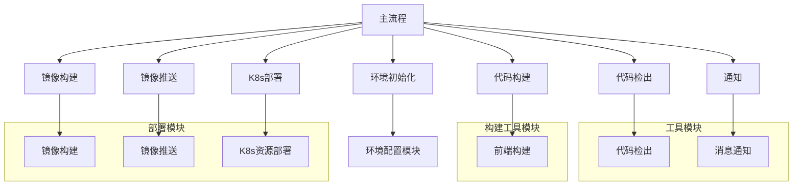

# JenkinsLib优化实践：模块化设计与多语言复用

> 本文记录了如何通过模块化设计优化Jenkins流水线，实现前端项目的自动化构建部署，并支持多语言项目复用流水线架构。

## 背景

在当前的Dotnet流水线中，虽然也已使用Jenkinslib编写流水线，但是所有流程步骤都集中在单一Groovy文件中（`vars/dotnet_build_pipeline.groovy`），这导致以下问题：

1. **复用困难**：其他语言项目（如前端）无法复用已有流程
2. **维护复杂**：每次修改都需要在单一文件中操作，无法满足job定制化需求
3. **扩展性差**：新增功能或调整流程需要改动核心文件

## 优化方案

采用**模块化设计**重构流水线：

- 将流水线拆分为独立功能模块
- 主流程通过调用模块组合完整流程
- 通过参数化配置支持多语言项目



## 准备工作

### 1. 构建Nginx基础镜像

基于生产环境使用的Nginx版本（1.24.0）及插件构建基础镜像：

```Dockerfile
FROM ubuntu:22.04
COPY ./sources.list /etc/apt/sources.list

# 安装依赖
RUN apt update && apt install -y g++ openssl libssl-dev ... 

# 编译Nginx及模块
ADD nginx_modules.tar.gz /usr/local/src/
WORKDIR /usr/local/src/nginx-1.24.0
RUN ./configure --prefix=/usr/local/nginx \
    --add-module=/usr/local/src/ngx_http_geoip2_module-3.4 \
    --add-module=/usr/local/src/headers-more-nginx-module-0.34 \
    && make && make install

# 复制配置
COPY nginx.conf /usr/local/nginx/conf/nginx.conf 
COPY healthz.html /usr/local/nginx/html/healthz.html

CMD ["/usr/local/nginx/sbin/nginx", "-g", "daemon off;"]
```

### 2. 配置文件准备

在Jenkins的`Managed files`中预定义关键模板：

#### Dockerfile模板
```dockerfile
FROM harbor.example.com/base/nginx:v1.24.0
COPY ./dist /data/h5/#H5_TARGET/
EXPOSE #HTTP_PORT
```

#### Kubernetes部署模板
```yaml
# Deployment模板
apiVersion: apps/v1
kind: Deployment
spec:
  containers:
    - name: #APP_NAME
      image: #IMAGE_NAME
      ports:
        - containerPort: #CONTAINER_PORT

# Service模板
apiVersion: v1
kind: Service
spec:
  ports:
    - port: #HTTP_PORT
      targetPort: #HTTP_PORT

# Ingress模板
apiVersion: networking.k8s.io/v1
kind: Ingress
spec:
  rules:
    - host: #DOMAIN_NAME
      http:
        paths:
          - backend:
              service:
                name: #APP_NAME-service
                port:
                  number: #HTTP_PORT
```

## Jenkins共享库结构

采用标准化目录结构，实现模块解耦：

```
jenkinslib/
├── src
│   └── org
│       ├── common
│       │   ├── Deploy.groovy    # 部署模块
│       │   └── Utils.groovy     # 工具模块
│       └── frontend
│           ├── Builder.groovy   # 前端构建
│           └── FrontendEnvConfigurator.groovy # 环境配置
└── vars
    └── frontend_build_pipeline.groovy # 主流程
```

## 核心模块详解

### 1. 工具模块 (Utils.groovy)

封装代码检出，发送通知等操作：

```groovy
package org.common
class Utils {
    def script
    Utils(script) { this.script = script }

    def now() {
        return new Date().format("yyyy-MM-dd HH:mm:ss")
    }

    void CodeCheckout(Map envCfg) {
      script.checkout([
        $class: 'GitSCM',
        branches: [[name: envCfg.GIT_BRANCH]],
          userRemoteConfigs: [[
          url: envCfg.REPO_URL,
          credentialsId: envCfg.GIT_CERT ?: 'jenkins-example-key'
          ]]
        ])
    }

    void getBuildName(Map envCfg) {
      def id = script.env.BUILD_NUMBER ?: 'N/A'
      def user = script.env.BUILD_USER ?: 'anonymous'
      def env = envCfg.DEPLOY_ENV
      def branch = envCfg.GIT_BRANCH
      def name = "#构建id:${id} 用户:${user} 环境:${env} 分支:${branch}"
      script.buildName(name)
    }

    void notifyWeChat(Map envCfg) {
      def message = envCfg.MESSAGE ?: '构建结果未知'
      def webhookUrl = envCfg.WEBHOOK_URL ?: 'https://qyapi.weixin.qq.com/xxxxx'
      def isFailure = message.contains('构建失败') || message.contains('Build failed!')
      def content = """### <font color="warning">**Jenkins任务通知**</font>
>项目名称: <font color="comment">${envCfg.APP_NAME}</font>
>构建环境: <font color="comment">${envCfg.DEPLOY_ENV}</font>
>构建用户: <font color="comment">${script.env.BUILD_USER}</font>
>构建结果：<font color="${envCfg.COLOR ?: 'black'}">${message}</font> 
>构建时间：<font color="comment">${envCfg.BUILD_TIME}</font>"""

      //判断当构建失败是at构建用户
      if (isFailure && script.env.BUILD_USER_ID) {
          content += "\n\n<@${script.env.BUILD_USER_ID}> 构建失败请关注!"
      }

      def payload = [
          msgtype : 'markdown',
          markdown: [ content: content ]
      ]
      def jsonPayload = new groovy.json.JsonBuilder(payload).toPrettyString()
      script.sh "curl -s -X POST -H 'Content-Type: application/json' -d '${jsonPayload}' '${webhookUrl}'"
    }
}
```

### 2. 部署模块 (Deploy.groovy)

封装Kubernetes部署操作，支持模板化配置：

```groovy
package org.common

class Deploy {
    def script
    Deploy(script) { this.script = script }

    void ImageBuild(Map envCfg) {
      script.configFileProvider([
        script.configFile(fileId: envCfg.DOCKERFILE_ID, targetLocation: 'Dockerfile')
      ]) {
          def content = script.readFile('Dockerfile')
          envCfg.DOCKERFILE_REPLACEVARS.each { k, v -> content = content.replaceAll(k, v) }
          script.writeFile(file: './Dockerfile', text: content)
         }
      script.sh("docker build -t ${envCfg.IMAGE_NAME} .")
    }

    //HARBOR_CREDENTIAL需提前创建
    void PushImage(Map envCfg) {
      script.withCredentials([
        script.usernamePassword(
          credentialsId: envCfg.HARBOR_CREDENTIAL,
          usernameVariable: 'username',
          passwordVariable: 'password'
        )
        ]) {
        script.sh """
          docker login -u $username -p $password ${envCfg.HARBOR_URL}
          docker push ${envCfg.IMAGE_NAME}
        """
        }
    }

    void DeployPod(Map envCfg) {
      script.configFileProvider([
        script.configFile(fileId: envCfg.DEPLOYMENT_ID, targetLocation: 'deployment.yml')
      ]) {
        def content = script.readFile('deployment.yml')
        envCfg.DEPLOYMENT_REPLACEVARS.each { k, v -> content = content.replaceAll(k, v) }
        script.writeFile(file: './deployment.yml', text: content)
        }
      script.sh("kubectl --kubeconfig ${envCfg.KUBECONFIG} apply -f ./deployment.yml")
    }

    void DeployService(Map envCfg) {
      script.configFileProvider([
        script.configFile(fileId: envCfg.SERVICE_ID, targetLocation: 'service.yml')
      ]) {
        def content = script.readFile('service.yml')
        envCfg.SERVICE_REPLACEVARS.each { k, v -> content = content.replaceAll(k, v) }
        script.writeFile(file: './service.yml', text: content)
        }
      script.sh("kubectl --kubeconfig ${envCfg.KUBECONFIG} apply -f ./service.yml")
    }

    void DeployIngress(Map envCfg) {
      script.configFileProvider([
        script.configFile(fileId: envCfg.INGRESS_ID, targetLocation: 'ingress.yml')
      ]) {
        def content = script.readFile('ingress.yml')
        envCfg.INGRESS_REPLACEVARS.each { k, v -> content = content.replaceAll(k, v) }
        script.writeFile(file: './ingress.yml', text: content)
        }
      script.sh("kubectl --kubeconfig ${envCfg.KUBECONFIG} apply -f ./ingress.yml")
    }
}
```

### 3. 前端代码构建模块 (Builder.groovy)

因各语言构建工具不一致，此模块单独配置：

```groovy
package org.frontend
class Builder {
    def script
    Builder(script) { this.script = script }

    void CodeBuild(Map envCfg) {
        script.sh """
            export NODE_HOME=${envCfg.BUILD_TOOL_HOME}
            export PATH=\$NODE_HOME/bin:$PATH
            ${envCfg.BUILD_TOOL} i
            ${envCfg.BUILD_TOOL} run build
        """
    }
}
```


### 4. 环境配置模块 (FrontendEnvConfigurator.groovy)

统一管理环境变量，支持多环境配置：

```groovy
package org.frontend
class FrontendEnvConfigurator {
    def script
    FrontendEnvConfigurator(script) { this.script = script }

    def createTag() {
        return new Date().format('yyyyMMddHHmmss') + "-${script.env.BUILD_ID}"
    }

    Map initEnv(Map cfg, String deployEnv, String buildTime) {
        def envCfg = [:]
        //传入变量
        envCfg.APP_NAME = cfg.appName
        envCfg.REPO_URL = cfg.repoUrl
        envCfg.DOCKERFILE_ID = cfg.dockerfileId        
        envCfg.DOCKERFILE_REPLACEVARS = cfg.dockerfileReplaceVars
        envCfg.DEPLOYMENT_ID = cfg.deploymentId
        envCfg.DEPLOYMENT_REPLACEVARS = cfg.deploymentReplaceVars
        envCfg.SERVICE_ID = cfg.serviceId
        envCfg.SERVICE_REPLACEVARS = cfg.serviceReplaceVars
        envCfg.INGRESS_ID = cfg.ingressId
        envCfg.INGRESS_REPLACEVARS = cfg.ingressReplaceVars
        envCfg.BUILD_TIME = buildTime

        //前端项目变量
        envCfg.H5_TARGET = cfg.h5Target
        envCfg.HTTP_PORT = cfg.httpPort
        envCfg.TLS_NAME = cfg.tlsName
        envCfg.CONFIGMAP_NAME = cfg.configMapName
        envCfg.BUILD_TOOL_HOME = cfg.buildToolHome
        envCfg.BUILD_TOOL = cfg.buildTool

        //固定变量
        envCfg.DEPLOY_ENV = deployEnv
        envCfg.HARBOR_URL = cfg.harborUrl ?: "harbor.example.com"
        envCfg.HARBOR_PROJECT = "base"
        envCfg.IMAGE_TAG = createTag()
        envCfg.IMAGE_NAME = "${envCfg.HARBOR_URL}/${envCfg.HARBOR_PROJECT}/${envCfg.DEPLOY_ENV}/${envCfg.APP_NAME}:${envCfg.IMAGE_TAG}"
        envCfg.GIT_CERT = "jenkins-example-key"
        envCfg.HARBOR_CREDENTIAL = "example-cert"

        // 部署环境差异处理，此处列出预发及本地测试环境区别
        switch (deployEnv) {
            envCfg.DEPLOY_NAMESPACE = 'pre'
            envCfg.GIT_BRANCH = 'pre'
            envCfg.KUBECONFIG = '/data/kubeconfig/pre/.kube/config'
            envCfg.POD_REPLICAS = '1'
            envCfg.REQUESTS_CPU = '500m'
            envCfg.REQUESTS_MEM = '1Gi'
            envCfg.LIMITS_CPU = '4'
            envCfg.LIMITS_MEM = '4Gi'
            envCfg.CONFIGFILE_NAME = "${envCfg.DEPLOY_NAMESPACE}-${cfg.configFileName}"
            envCfg.DOMAIN_NAME = "${envCfg.DEPLOY_NAMESPACE}-${cfg.domainName}"
            break
          default:
            envCfg.DEPLOY_NAMESPACE = deployEnv
            envCfg.GIT_BRANCH = deployEnv
            envCfg.KUBECONFIG = '/data/kubeconfig/non-prod/.kube/config'
            envCfg.POD_REPLICAS = '1'
            envCfg.REQUESTS_CPU = '300m'
            envCfg.REQUESTS_MEM = '1Gi'
            envCfg.LIMITS_CPU = '1'
            envCfg.LIMITS_MEM = '1Gi'
            envCfg.CONFIGFILE_NAME = "${envCfg.DEPLOY_NAMESPACE}-${cfg.configFileName}"
            envCfg.DOMAIN_NAME = "${envCfg.DEPLOY_NAMESPACE}-${cfg.domainName}"
        }

        //根据环境重新赋值Dockerfile文件
        envCfg.DOCKERFILE_REPLACEVARS = [
          '#H5_TARGET': envCfg.H5_TARGET,
          '#HTTP_PORT': envCfg.HTTP_PORT
        ]

        //根据环境重新赋值Deployment文件
        envCfg.DEPLOYMENT_REPLACEVARS = [
          '#APP_NAME': envCfg.APP_NAME,
          '#DEPLOY_NAMESPACE': envCfg.DEPLOY_NAMESPACE,
          '#POD_REPLICAS': envCfg.POD_REPLICAS,
          '#IMAGE_NAME': envCfg.IMAGE_NAME,
          '#CONTAINER_PORT': envCfg.HTTP_PORT,
          '#REQUESTS_CPU': envCfg.REQUESTS_CPU,
          '#REQUESTS_MEM': envCfg.REQUESTS_MEM,
          '#LIMITS_CPU': envCfg.LIMITS_CPU,
          '#LIMITS_MEM': envCfg.LIMITS_MEM,
          '#CONFIGMAP_NAME': envCfg.CONFIGMAP_NAME,
          '#CONFIGFILE_NAME': envCfg.CONFIGFILE_NAME
        ]

        //根据环境重新赋值Service文件
        envCfg.SERVICE_REPLACEVARS = [
          '#APP_NAME': envCfg.APP_NAME,
          '#DEPLOY_NAMESPACE': envCfg.DEPLOY_NAMESPACE,
          '#HTTP_PORT': envCfg.HTTP_PORT
        ]

        //根据环境重新赋值Ingress文件
        envCfg.INGRESS_REPLACEVARS = [
          '#APP_NAME': envCfg.APP_NAME,
          '#DEPLOY_NAMESPACE': envCfg.DEPLOY_NAMESPACE,
          '#DOMAIN_NAME': envCfg.DOMAIN_NAME,
          '#HTTP_PORT': envCfg.HTTP_PORT,
          '#TLS_NAME': envCfg.TLS_NAME
        ]

        return envCfg
    }
}
```

### 3. 主流程 (frontend_build_pipeline.groovy)

串联完整构建部署流程：

```groovy
pipeline {
    agent { label 'pipeline-agent' }
    
    parameters {
        choice(name: 'DEPLOY_ENV', choices: ['dev','test','pre','prod'])
    }

    stages {
        stage('InitENV') {
            steps {
                script {
                    envCfg = new FrontendEnvConfigurator().initEnv(cfg, params.DEPLOY_ENV)
                }
            }
        }
        
        stage('CodeBuild') {
            steps {
                script {
                    new Builder().CodeBuild(envCfg)
                }
            }
        }
        
        stage('ImageBuild') {
            steps {
                script {
                    new Deploy().ImageBuild(envCfg)
                }
            }
        }
        
        // 其他阶段...
    }
    
    post {
        success {
            script {
                new Utils().notifyWeChat([COLOR: 'green', MESSAGE: '构建成功'])
            }
        }
        failure {
            script {
                new Utils().notifyWeChat([COLOR: 'red', MESSAGE: '构建失败'])
            }
        }
    }
}
```

## 多语言复用方案

通过模块化设计，本方案可轻松支持其他语言项目：

### 复用方式
1. **新增语言模块**：在`src/sk/`下创建对应语言目录（如`java`）
2. **实现构建逻辑**：在新建目录中实现语言特定的构建逻辑
3. **调整主流程**：在`vars/`中创建新主流程文件，调用通用模块

### 复用示例（Dotnet项目）

```groovy
// vars/dotnet_build_pipeline.groovy
pipeline {
    // ... 相同环境初始化
    
    stages {
        stage('DotnetBuild') {
            steps {
                script {
                    new DotnetBuilder().Build(envCfg) // 调用Dotnet专用构建器
                }
            }
        }
        
        // 复用已有模块
        stage('ImageBuild') {
            steps {
                script {
                    new Deploy().ImageBuild(envCfg)
                }
            }
        }
    }
}
```

## Jenkinsfile配置示例

前端项目的Jenkinsfile配置：

```groovy
@Library("pipelinelib@master") _

frontend_build_pipeline {
  // 基础配置
  appName = 'baseplat-ui'
  repoUrl = 'git@example.com:example/example.git'
  
  // 构建配置
  httpPort = '80'
  buildTool = '/data/nodejs/node-v18.20.2/bin/pnpm'
  
  // 部署配置
  configMapName = 'example-ui-cm'
  domainName = 'example.com'
}
```

## 结语

通过本次优化已实现：
1. **流水线复用率提升**：前端流水线配置时间由30分钟降至10分钟
2. **维护成本降低**：各模块独立维护，变更影响范围可控
3. **扩展性增强**：新增语言支持只需添加对应模块
4. **标准化部署**：所有项目使用统一部署流程

**经验总结**：模块化设计是持续集成系统的核心，它不仅解决了当前的前端部署需求，更为未来多语言项目支持奠定了坚实基础。
